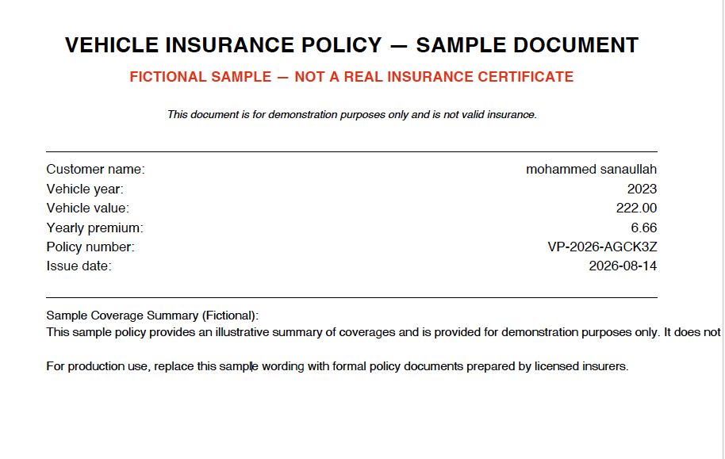

# 02 — Vibe Programming

A hands-on learning project exploring Vibe Programming through a requirements-driven software development workflow.

## Project

### Vehicle Insurance Policy Generator

A fictional CLI application that accepts:

- Customer name
- Vehicle manufacturing year
- Vehicle price

It calculates a yearly premium and generates a one-page sample vehicle insurance policy as a PDF.

The generated document includes:

- Customer name
- Vehicle year
- Vehicle value
- Yearly premium
- Policy number
- Issue date
- Fictional sample disclaimer

Generated PDFs are stored in the `output/` directory and are not
committed to the repository.

## Architecture

```text
02-vibe-programming/
├── README.md
├── prompts/
│   ├── 01-requirements-analysis.md
│   ├── 02-architecture-analysis.md
│   └── 10-testing.md
├── vehicle-insurance/
│   ├── src/
│   │   ├── main.py
│   │   ├── policy.py
│   │   ├── validation.py
│   │   ├── premium_calculator.py
│   │   ├── policy_number.py
│   │   ├── filename_utils.py
│   │   └── pdf_generator.py
│   ├── tests/
│   │   └── test_app.py
│   └── output/
│       └── # generated PDFs — ignored by Git
└── assets/
    └── vehicle-insurance-sample.png

```

## Sample Output

The application generates a one-page fictional vehicle insurance
policy PDF with dynamic customer and vehicle information.

